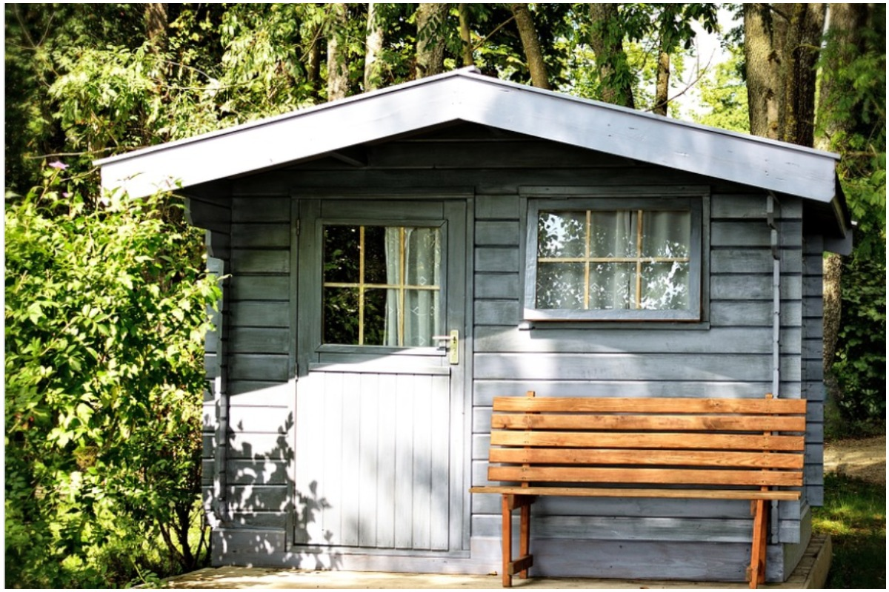

If you’re a homeowner looking to create a separate space from your home for a [mother-in-law suite](https://www.redfin.com/blog/what-is-a-mother-in-law-suite/), workspace, or rental opportunity, building an accessory dwelling unit, or ADU, may be the perfect option. The potential uses and benefits of an ADU are endless, but building one can be difficult with every city having its own zoning restrictions, HOA regulations, and building laws. Laws surrounding ADUs from [San Francisco, CA](https://www.redfin.com/city/17151/CA/San-Francisco/filter/status=active) are completely different from the laws in [Providence, RI](https://www.redfin.com/city/15272/RI/Providence).

To give you some clarity, Redfin asked ADU experts to share their best tips and tricks that will help you successfully build an ADU. Check out my tip on [14 Expert Tips to Consider Before You Build an ADU.](https://www.redfin.com/blog/build-an-adu/)