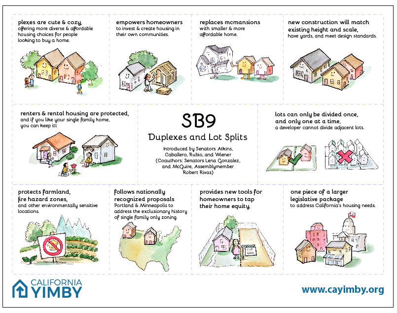

What is SB 8, SB 9 and SB 10?  Read the full press release [HERE](https://www.gov.ca.gov/2021/09/16/governor-newsom-signs-historic-legislation-to-boost-californias-housing-supply-and-fight-the-housing-crisis/).  

***SB 8** extends the Housing Crisis Act of 2019 to jumpstart more housing production extending the provisions of the Housing Crisis Act of 2019 through 2030.*

***SB 9** gives homeowners additional tools to add critically needed new housing and help ease California’s housing shortage.  It eliminates single family zoning restrictions on duplex and four-plexes.*

* Allows property owners to have two units on a parcel zoned for single-family housing — creating a duplex — and to split a residential parcel into two pieces.

  * requires a property owner who wants to split the parcel to agree to live in one of the housing units for at least three years, unless the owner is a nonprofit.  It contains important protections against the displacement of existing tenants.

    * newly formed plots to be at least 1,200 square feet in size and mandating that one parcel can’t be smaller than 40% of the original lot size.

  Excludes earthquake fault zones, historic sites/landmark districts and land within the "very high" fire hazard zones. 

  

***SB 10** establishes voluntary, streamlined process for cities to zone for multi-unit housing — making it easier and faster to construct housing*

* It allows, but not does require, cities to zone a parcel for up to 10 residential units if it’s located in a “transit-rich area.”

  Interested in knowing if building another unit makes financial sense for your property?  Check out our app at [ADUROI.com.](https://aduroi.com/#features)