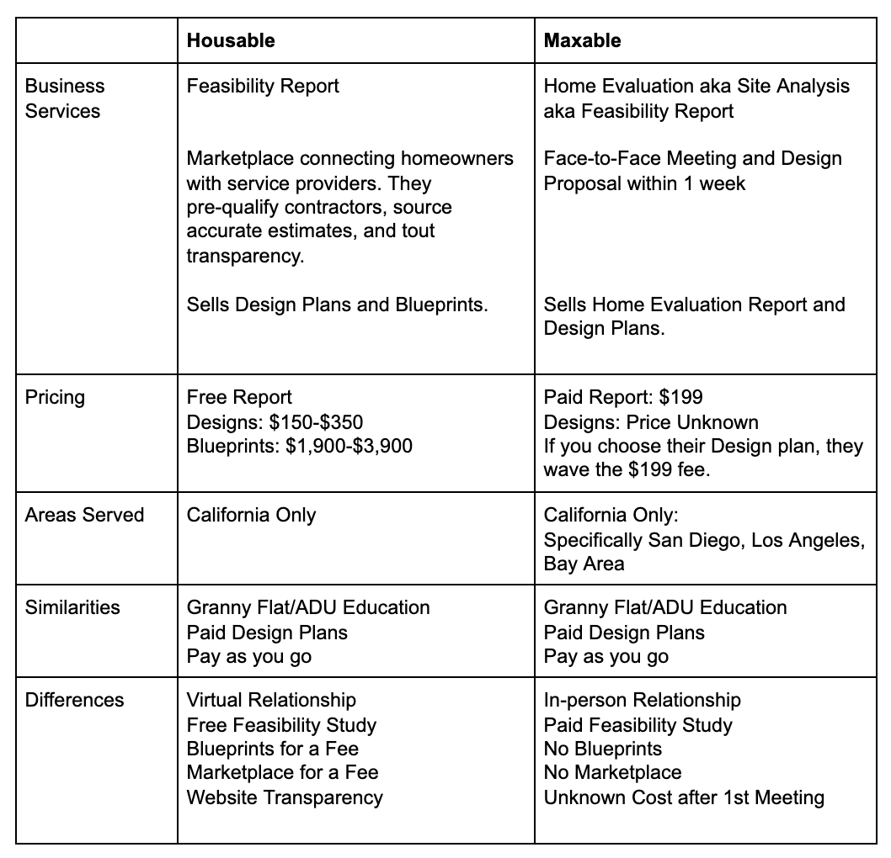

Two California based Accessory Dwelling Unit (ADU) companies are going head-to-head trying to be the first to market in educating homeowners on defining an ADU, assessing your property to see if your site is suitable for adding an ADU, selling you design plans and sometimes construction documents required for city permits and detailed contractor quotes.

What exactly do they provide? Find out below as we lay out their similarities and differences.

